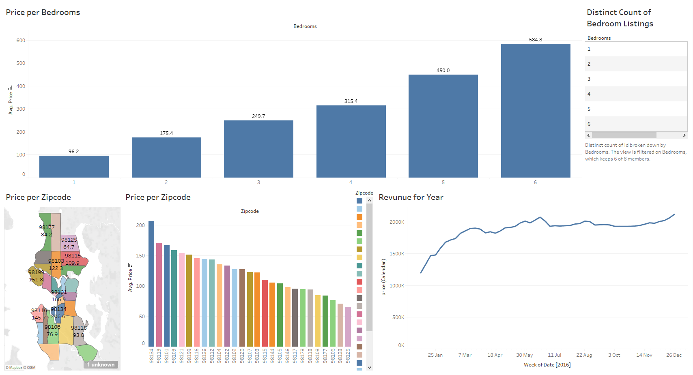

# Tableau-Analysis
This project used Tableau to analyse an Airbnb dataset, exploring location, number of bedrooms, price, yearly revenue, and others data points.

It leveraged Tableau’s full range of features, including data visualisation, interactive dashboards, filters, and calculated fields, to uncover trends and insights.

